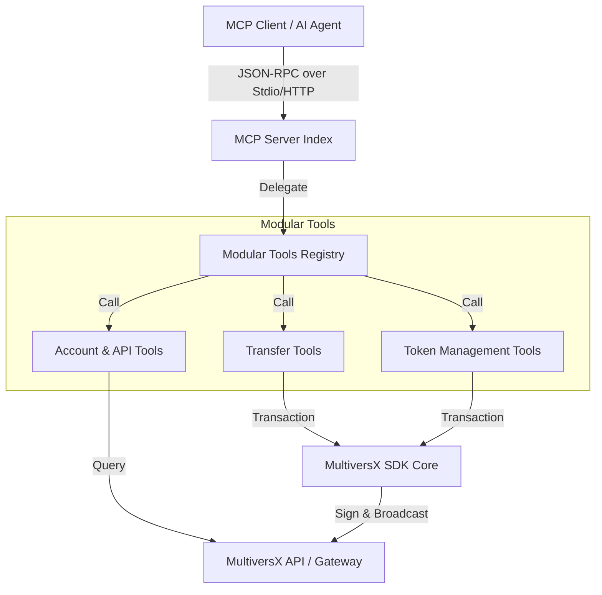

# Architecture Overview: MultiversX MCP Server

This document describes the high-level architecture and data flow of the MultiversX MCP server.

## System Interaction Diagram

## Core Components

### 1. Server Entry Point (`src/index.ts`, `src/server.ts`)
The server supports two transport modes:
- **Stdio**: Standard MCP interaction for desktop clients like Claude.
- **HTTP**: Fastify-based server for API-based integrations.

### 2. Modular Tools (`src/tools/`)
Each tool is implemented as a standalone asynchronous function with a Zod schema for input validation. This modularity ensures:
- **High Testability**: Tools can be unit-tested without the full server context.
- **Maintainability**: Protocol changes (like RelayedV3) only affect specific tool files.

### 3. Network & Wallet Config (`src/tools/networkConfig.ts`, `src/tools/walletConfig.ts`)
- **Network**: Manages Devnet, Testnet, and Mainnet configurations using `ApiNetworkProvider`.
- **Wallet**: Handles PEM loading and determines the `MVX_SIGNING_MODE` (signed vs. unsigned).

### 4. Shared Types (`src/tools/types.ts`)
A centralized `ToolResult` interface standardizes the output format across all tools, ensuring consistent client-side parsing.

## Data Flow: Transaction Signing

1. **Request**: The client calls a tool (e.g., `send-egld`).
2. **Construction**: The tool uses the `MultiversX SDK` to build a `Transaction` object.
3. **Signing**: If `MVX_SIGNING_MODE=signed`, the tool loads the private key from the PEM file and signs the transaction.
4. **Broadcast**: The signed transaction is sent to the MultiversX API.
5. **Response**: The tool returns the transaction hash and an explorer link to the client.
